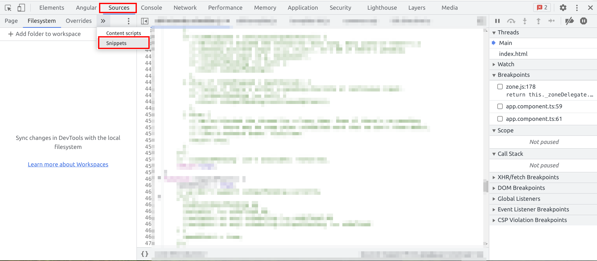
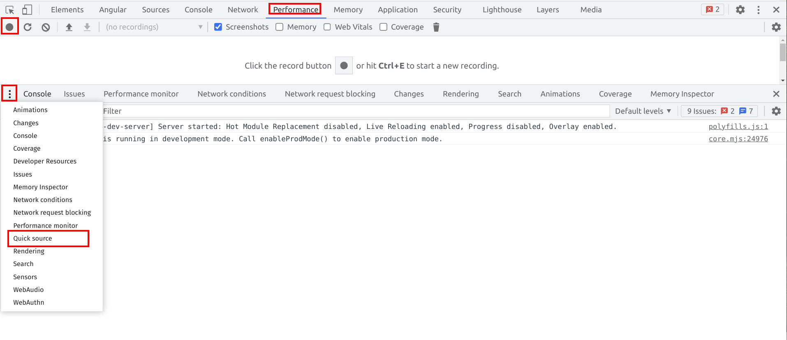

# Sources Tab Exercise

In this exercise you will get to know add yet another tool to put into your performance audit toolbox.
You will learn how to use the `Chrome DevTools Sources Tab` to execute javascript code on an existing application.
The code snippets you will use in this exercise will provide you valuable performance metrics and **are** used in real
world performance audits.

Some of them will require you to run a snippet while recording a flame chart, simultaneously.

## Prepare yourself

!!! If you want, you can pick any target to run those scripts on. !!!

Otherwise, serve the angular movies application and open the browser at `localhost:4200`.

> **Hint**: if possible, try to run the audit on the original state (main branch)
> make sure to keep your changes, though. As you probably want to keep your already existing improvements for later analysis

Open the `DevTools` and navigate to the `Sources Tab`. Find the `snippets` tab within the `Sources` tab.

## Be a performance auditor 🕵️

There multiple ways to execute snippets, you can choose any of them:

* [run in console](https://github.com/push-based/awesome-web-performance-snippets/blob/main/docs/how-to-use-it-with-console-tab.md)
* [run as bookmark](https://github.com/push-based/awesome-web-performance-snippets/blob/main/docs/how-to-use-it-with-bookmarks.md)
* [run with sources tab](https://github.com/push-based/awesome-web-performance-snippets/blob/main/docs/how-to-use-it-with-sources-tab.md)

Please at least try each of those variants one time to get an idea of how different they
are in usage.

Your task now is to inspect and run the following snippets on your chosen target.
For each snippet, please inspect the outcome carefully. Some snippets will reveal potentials for improvements. Please take notes if possible,
as we later want to discuss your findings and suggestions.

If you've chosen to go with the angular movies app, you can easily grab some intel
by inspecting not only the local target, but also the [deployed app](https://angular-movies-a12d3.web.app/list/category/popular).
This will probably reveal some information what can be done better on our current state.

### Page State Analysis Snippets

Page state analysis snippets provide information about the current state of application
and reveal potential for improvements. 

* [check images](https://github.com/push-based/awesome-web-performance-snippets/blob/main/snippets/check-image-usage/Readme.md)
* [check header](https://github.com/push-based/awesome-web-performance-snippets/tree/main/snippets/check-header)
* [blocking scripts](https://github.com/push-based/awesome-web-performance-snippets/tree/main/snippets/scripts-loading)
* [resource hints](https://github.com/push-based/awesome-web-performance-snippets/tree/main/snippets/resources-hints)
* [get current LCP element](https://github.com/push-based/awesome-web-performance-snippets/tree/main/snippets/lcp)
* [getDomEventListeners](https://github.com/push-based/awesome-web-performance-snippets/blob/main/snippets/getDOMEventListeners/Readme.md)

### Runtime Analysis Snippets

Runtime analysis snippets are meant to be run while also being recorded
with the `Performance` tab.

For this, you might want to use the `Quick Sources` tab in order to have
the `Performance` tab open while being able to interact with the code snippet.

* [full relayout](https://github.com/push-based/awesome-web-performance-snippets/tree/main/snippets/full-relayout)
* [reDOM](https://github.com/push-based/awesome-web-performance-snippets/tree/main/snippets/re-apply-dom)

## Bonus: test snippets on other pages

If you've done your inspection on the local angular movies app, of course compare your local environment against the
[currently deployed app](https://angular-movies-a12d3.web.app/list/category/popular).

Also, choose different targets and/or snippets. You'll find a list below.

## Bonus: more snippets

Below you find links leading to even more snippets ready2use to analyze different performance metrics on any browser application.
Inspect the lists and see you find useful snippets with metrics you are interested in.

One particular challenge would be to print out recorded `long-task`s with the `PerformanceObserver` while you
are interacting with the application.

https://github.com/push-based/awesome-web-performance-snippets/tree/main/snippets

https://github.com/nucliweb/webperf-snippets
